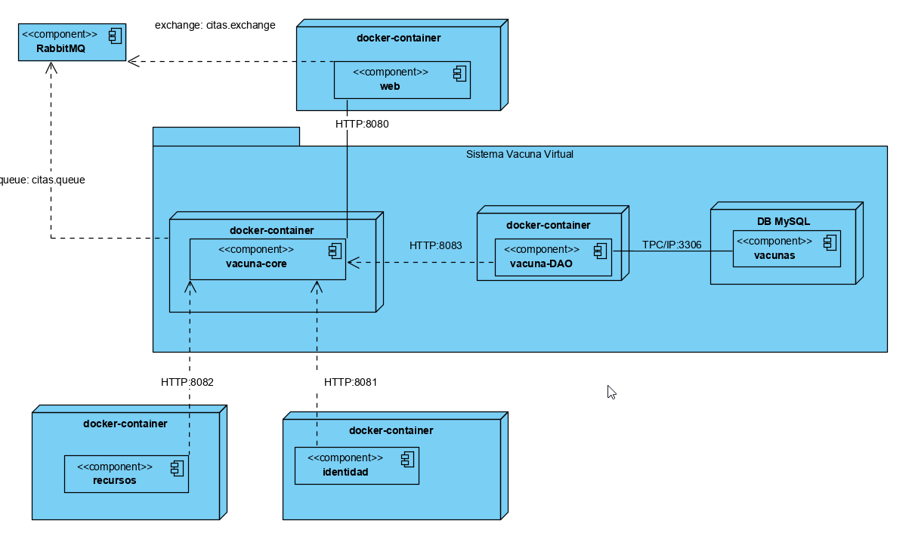

## Proyecto Final  DSD - 2020-2

## Integrantes Grupo 3: 
+ Eveling Castillo Samanez​
+ Luis Felipe Flores Gonzales​
+ Jose Enrique Lluncor Vilela​
+ Yesmi Torres Paucar​
+ Arturo Victorino Vernaza Vargas​
+ Victor Eduardo Torres Tejada​

## Diagrama de despliegue

## Frameworks y Herramientas usadas:
+ Spring Boot
+ RabbitMQ
+ Mysql
+ JPA
+ Swagger

## Referencias:
Usamos como referencia estas páginas: 
 + https://www.javainuse.com/spring/spring-boot-rabbitmq-hello-world
 + https://www.javainuse.com/messaging/rabbitmq/listeners