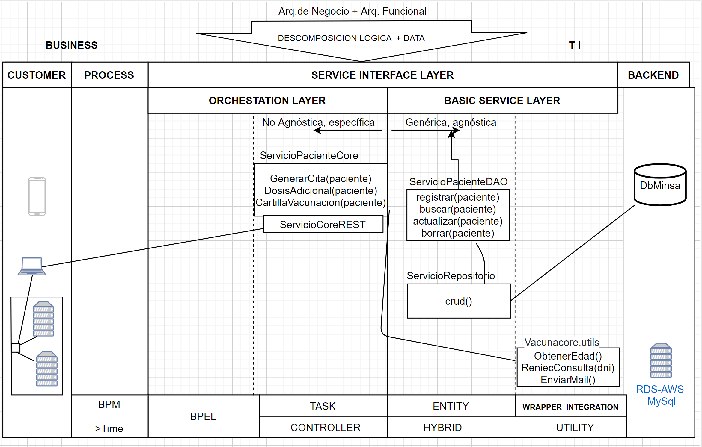

## Proyecto Final  DSD - 2020-2

## Integrantes Grupo 3: 
+ Eveling Castillo Samanez​
+ Luis Felipe Flores Gonzales​
+ Jose Enrique Lluncor Vilela​
+ Yesmi Torres Paucar​
+ Arturo Victorino Vernaza Vargas​
+ Victor Eduardo Torres Tejada​

## Diagrama de Arquitectura SOA

## Diagrama de despliegue

## Frameworks y Herramientas usadas:
+ Spring Boot
+ RabbitMQ
+ Mysql
+ JPA
+ Swagger

## ULRs:
+ Web: http://127.0.0.1:3000
+ Identidad: http://127.0.0.1:8081/dao/reniec/swagger-ui.html#/
+ Recursos: http://127.0.0.1:8082/dao/minsa/swagger-ui.html#/
+ Vacuna DAO: http://127.0.0.1:8083/dao/vacuna/swagger-ui.html#/
+ Vacuna Core: http://127.0.0.1:8080/api/vacuna/swagger-ui.html#/
+ RabbitMQ: http://127.0.0.1:15672/

## Referencias:
Usamos como referencia estas páginas: 
 + https://www.javainuse.com/spring/spring-boot-rabbitmq-hello-world
 + https://www.javainuse.com/messaging/rabbitmq/listeners
